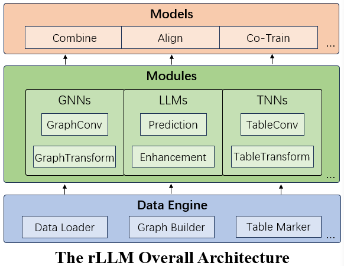

rLLM Documentation
===================
`rLLM <http://arxiv.org/abs/2407.20157>`__ (relationLLM) is an easy-to-use Pytorch library for Relational Table Learning with LLMs, by performing two key functions:

1. Breaks down state-of-the-art GNNs, LLMs, and TNNs as standardized modules.
2. Facilitates novel model building in a "combine, align, and co-train" way.

Highlight Features:

- LLM-friendly: Modular interface designed for LLM-oriented applications, integrating smoothly with LangChain and Hugging Face transformers.
- One-Fit-All Potential: Processes various graphs (like Social/Citation/E-commerce Networks) by treating them as multiple tables linked by foreign keys.
- Novel Datasets: Introduces three new relational table datasets useful for RTL-typle model design. Includes standard tasks like classification and regression, with examples and baseline results.
- Community Support: Maintained by students and teachers from Shanghai Jiao Tong University and Tsinghua University. Supports the SJTU undergraduate course "Content Understanding (NIS4301)" and the graduate course "Social Network Analysis (NIS8023)".

.. toctree::
   :maxdepth: 1
   :caption: INTRODUCTION

   introduce/graph_data_handle
   introduce/table_data_handle
   introduce/llm_data_handle

.. toctree::
   :maxdepth: 1
   :caption: TUTORIALS

   tutorial/transforms
   tutorial/convolutions
   tutorial/gnns
   tutorial/tnns
   tutorial/rtls
   tutorial/llm_methods
   tutorial/batch_training

.. toctree::
   :maxdepth: 1
   :caption: API REFERENCE

   modules/rllm.data
   modules/rllm.datasets
   modules/rllm.llm
   modules/rllm.nn
   modules/rllm.dataloader
   modules/rllm.transforms
   modules/rllm.utils

.. toctree::
   :maxdepth: 1
   :caption: CHEATSHEETS

   cheatsheet/model_cheatsheet

.. toctree::
   :maxdepth: 1
   :caption: EXTERNAL RESOURCES

   external_resources/external_resources

